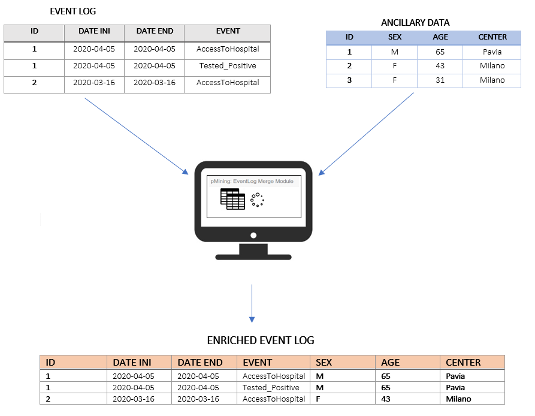

# Enrichment Module: “pMining: EventLog Merge Module”

In order to better understand the functioning of this module, it is necessary, while moving on to the description of its components, to introduce the concepts of **"Ancillary Data"**, **crossectional variables**, **longitudinal variables** and explain the merging techniques (**"as Event"** and **"by Attribute"**) which represent the real core of the enrichment module. 

For this reason, in the next section will be introduced some useful concepts for a real understanding of the use and purpose of the module itself. 

## Background information

**The main function of this module is to take in input an Event Log**, made up of the standard columns 

  |ID|DATE INI|DATE END|EVENT|
  |--------|--------|--------|--------|

and starting from this **try to enrich it** (by adding new rows and/or new columns) with information from **Ancillary Data**.

{width=100%}
 
 

### Ancillary data type

**Ancillary data** are data sets containing informations which can be added to Event Log. Ancillary data sets can contain any type of information, in particular they can be of the following types:
 

- **Crossectional**: data sets that contain only "Crossectional" information, i.e. not time-dependent. 
An example could be a data set composed as follows:

|ID|SEX|AGE|CENTER
|--------|--------|--------|--------|
|  1 |  F | 45|Pavia
|  2  |  M |68|Milano
|  3 |  M | 54|Pavia
|  4  |  F |32|Pavia

 

- **Longitudinal** : data sets containing 'Longitudinal' (time-dependent) information.
Within the set of longitudinal data sets it is appropriate to make a further classification, distinguishing two different types of longitudinal variables:

   1. ***"numerical"*** **longitudinal variables**. These are time-dependent variables with a numerical value associated (i.e. a measure). 
An example of numerical longitudinal data set could be the following.

  |ID|EXAM CODE (LOINC)|DESCRIPTION|DATE| MEASURE|UNIT 
  |--------|--------|--------|--------|--------|--------| 
  |  1 | 1742-6  | 	alanine aminotransferase (ALT)|2020-04-23|26|U/L
  |  1  |  	1920-8 |aspartate aminotransferase (AST)|2020-04-23|12|U/L
  |  2 |  1975-2 | total bilirubin|2020-05-11|0.4|mg/dL	
  |  3  |  1988-5	 |C-reactive protein (CRP) (Normal Sensitivity)|2020-10-05|4.8|	mg/L
  
  According to the logic followed in this application, the longitudinal variable of this data set can be both the variable "EXAM CODE" or "DESCRIPTION" since the values assumed by these   variable univocally express a certain type of exam. Furthermore, we can define this as numerical longitudinal variable because each examination is associated with a measurement. 

   2. ***"categorical"*** **longitudinal variables**. These are also time-dependent variables, but unlike the numerical logitudinal variables, no measurement is associated with these variables. 
An example of a data set containing categorical logitudinal variables could be the following:

  |ID|PHECODE|DESCRIPTION|DATE|
  |--------|--------|--------|--------|
  |  1 | 		550|Abdominal hernia|2020-04-23|
  |  1  |  		480|Pneumonia|2021-03-14|
  |  2 |  250 | Diabetes mellitus	|2020-05-11|	
  |  3  |  	296 |Mood disorders|2020-10-05|	
  
   

- **Mixed**: data set containing both longitudinal and crossectional variables (i.e.  [ID, SEX, AGE, DEATH, DEATH.DATE]):

  |ID|SEX|DEATH|DEATH DATE|
  |--------|--------|--------|--------|
  |  1 | 	F|0||
  |  2  | M |0||
  |  3 |  M|1	|2020-05-11|	
  |  4  |F |0||	

- **Event log**: it is possible that the ancillary data to be integrated to the original event log are themselves events log organised in the classical structure: 

  |ID|DATE INI|DATE END|EVENT|
  |--------|--------|--------|--------|
  |  1 | 2020-04-12| 2020-06-01|endocrine/metabolic
  |  2  | 2021-01-25 |2021-03-30|mental disorders
  |  3 |  2019-11-08|2019-12-28|	symptoms|	
  |  4  |2021-06-11 |2021-09-21|injuries & poisonings|	

It is also important to explicit that each ancillary data set must contain a **foreign key** that allows the ancillary data set to match the event log. 

*For example, supposing that we want to add to the original Event Log composed of [ID, DATE INI, DATE END, EVENT] the information on sex and age contained in the ancillary data set [PAZ.ID, SEX, AGE, CENTER], it will be necessary to specify both the key of the ancillary data set (in this case "PAZ. ID") and the key of the Event Log (in this case "ID"). In fact, the AGE and SEX information will be added from the correspondence "ID" (key of Event Log) and "PAZ.ID" (key of Ancillary data set).*

Also the enrichment module is made up of several sections and the aim of this paragraph is to show the various sections of the module, their use and the logic behind their creation.

### Merging Techniques
In order to achieve the actual enrichment of the event log through the information coming from the ancillary data, two different techniques have been implemented:

- **Merge as Event** ;
- **Merge by Attributes** ;

The central point of both merge techniques is to compute an output that is event-centric and that contains new information by adding new attributes or new events to the original Event Log.

Therefore, in both cases the starting point will be the event log and the substantial difference between the two techniques is the different logic used to incorporate the information coming from the time-dependent variables. 

By **Merge as Event** techinques *new informations are added as new event* so by adding new rows to the original Event Log; Using **Merge by Attribute** technique, *new informations are added as new column, so as attribute of the event*. 
 

{width=100%}
 
 

This is how the two interfaces for parameter setting and merge rules look like:

- **Merge as Event**
  
  {width=100%}
  
   
  
  
- **Merge by Attribute**

   {width=100%}

As far as **crossectional variables** are concerned (i.e. those that do not depend on time), they will be treated in the same way in both techniques by adding new columns relating to the single variable. 

To clarify what happens with crossectional variables, let's look at an example:

Suppose we want to add to our event log in the standard format:

  |ID|DATE INI|DATE END|EVENT|
  |--------|--------|--------|--------|
  |  1 | 2020-04-12| 2020-06-01|endocrine/metabolic
  |  2  | 2021-01-25 |2021-03-30|mental disorders
  |  3 |  2019-11-08|2019-12-28|	symptoms|	
  |  4  |2021-06-11 |2021-09-21|injuries & poisonings|	
  
  
the crossectional information contained in the ancillary data set structured as follows:

  |ID|SEX|AGE|
|--------|--------|--------|
|  1 |  F | 45|
|  2  |  M |68|
|  3 |  M | 54|
|  4  |  F |32|

The output for both techniques will be an event log with this structure:

  |ID|DATE INI|DATE END|EVENT|SEX| AGE
  |--------|--------|--------|--------|--------|--------|
  |  1 | 2020-04-12| 2020-06-01|endocrine/metabolic|F|45
  |  2  | 2021-01-25 |2021-03-30|mental disorders|M|68
  |  3 |  2019-11-08|2019-12-28|	symptoms|	M|54
  |  4  |2021-06-11 |2021-09-21|injuries & poisonings|F|32	
  
In the next section, the two merge techniques will be presented in detail also using examples in order to better understand the application of the two techniques on the remaining types of ancillary data (longitudinal, mixed and eventlog).

#### Merge as Event

The **"merge as event" technique** allows new events to be added to the original event log. It is therefore clear that what the user will have to do in this case is to explicit the variables of the ancillary data set which represent the variables DATE INI, DATE END and EVENT (which are the standard variables that make up an event log). 

Let's assume to have as starting point an Event Log in the standard format describing the different wards in which a patient was admitted during his stay:

  |ID|DATE INI|DATE END|EVENT|
  |--------|--------|--------|--------|
  |  1 | 2020-04-12| 2020-06-01|ICU
  |  2  | 2021-01-25 |2021-03-30|Covid
  |  3 |  2019-11-08|2019-12-28|	Subintensive|	
  |  4  |2021-06-11 |2021-09-21|Cardiology |	

Let's also suppose we wanted to enrich this Event Log with some informations coming from different type of ancillary data set using the **merge as event** technique. 

*In the next sections all the possible use case will be shown*

##### Enrichment from longitudinal ancillary data set: 
In this case we have time dependent variables that can be either categorical or numeric.   

1. **Numeric longitudinal dalta**: let's consider a data set composed as follows
  
  |ID |EXAM CODE (LOINC)|DESCRIPTION|DATE| MEASURE|UNIT 
  |--------|--------|--------|--------|--------|--------| 
  |  1 | 1742-6  | 	alanine aminotransferase (ALT)|2020-04-23|26|U/L
  |  1  |  	1920-8 |aspartate aminotransferase (AST)|2020-04-23|12|U/L
  |  2 |  1975-2 | total bilirubin|2020-05-11|0.4|mg/dL	
  |  3  |  1988-5	 |C-reactive protein (CRP) (Normal Sensitivity)|2020-10-05|4.8|	mg/L
   
  and let's suppose that **the aim of this merge is to include in the original event log, also the information related to the laboratory examinations** that the patients underwent. 
  So, what we want to output is an Event Log that provides, for each patient both information about their ward changes and the tests and procedures they underwent. 
  
The first thing to do is to identify the **key of the data** set, i.e. the variable that is the link between this new data set and the original Event Log. In this case, the key is the variable ID. 

After that, we need to **explicit the information** in which we are interested (in this example the exams) **in the standard Event Log format**:

 |ID|DATE INI|DATE END|EVENT|
  |--------|--------|--------|--------|
  

 

- The **ID** variable is the variable we have selected as the **key** to the table.

- The **EVENT** variable will be the **longitudinal variable** that we want to enrich the Event Log with.

- The variables **DATE INI** and **DATE END** are the **time indicators**.

In our case, the time variable we are interested in is the variable "EXAM CODE" and as a time indication we will use the variable "EXAM DATE" which will represent both the starting and the ending date of the event "exam".

So the ancillary data set will take this new form: 

|ID|DATE INI|DATE END|EVENT|
|--------|--------|--------|--------|
|  1 | 2020-04-23| 2020-04-23| 1742-6
|  1 | 2020-04-23 |2020-04-23|1920-8 
|  2 | 2020-05-11|2020-05-11|	1975-2
|  3 |2020-10-05 |2020-10-05|1988-5

At this point, the last step remaining is to **add the new rows obtained in this way to the initial event log**. The output will be as follows:

  |ID|DATE INI|DATE END|EVENT|
  |--------|--------|--------|--------|
  |  1 | 2020-04-12| 2020-06-01|ICU
  | **1** | **2020-04-23** |**2020-04-23**|**1920-8 **|**12**
  | **1** | **2020-04-23** |**2020-04-23**|**1920-8 **
  |  2  | 2021-01-25 |2021-03-30|Covid
  | **2** | **2020-05-11**|**2020-05-11**|	**1975-2**
  |  3 |  2019-11-08|2019-12-28|	Subintensive|	
  | **3** |**2020-10-05** |**2020-10-05**|**1988-5**
  |  4  |2021-06-11 |2021-09-21|Cardiology |

In addition to what has been described up to this point, by using this merge technique with **numerical longitudinal variables**, we may also be interested in acquiring information regarding the value assumed by the temporal variable (in our example, we may wish to enrich the event log by adding the value of the measurement). To do so, a column containing the measurement information is add  to the event log created from the ancillary data. 

The result will be an event log with a slightly modified structure:

|ID|DATE INI|DATE END|EVENT|VALUE
|--------|--------|--------|--------|--------
|  1 | 2020-04-23| 2020-04-23| 1742-6|26
|  1 | 2020-04-23 |2020-04-23|1920-8 |12
|  2 | 2020-05-11|2020-05-11|	1975-2|0.4
|  3 |2020-10-05 |2020-10-05|1988-5|4.8

***Please note:*** that since the original event log has no value column, the value column will also be added for events in the original event log, but its values will remain null for those events: 

  |ID|DATE INI|DATE END|EVENT|VALUE|
  |--------|--------|--------|--------|--------|
  |  1 | 2020-04-12| 2020-06-01|ICU|
  |  **1** | **2020-04-23**| **2020-04-23**| **1742-6**|**26**
  | **1** | **2020-04-23** |**2020-04-23**|**1920-8 **|**12**
  |  2  | 2021-01-25 |2021-03-30|Covid|
  | **2** | **2020-05-11**|**2020-05-11**|	**1975-2**|**0.4**
  |  3 |  2019-11-08|2019-12-28|	Subintensive|	
  | **3** |**2020-10-05** |**2020-10-05**|**1988-5**|**4.8**
  |  4  |2021-06-11 |2021-09-21|Cardiology |
  
   
   
  
  2. **Categorical longitudinal value** : let's now consider this data set:
  
  |ID|PHECODE|DESCRIPTION|DATE| DIAG.CODE
  |--------|--------|--------|--------|--------|
  |  1 | 		550 |Abdominal hernia|2020-04-23|
  |  1  |  		480|Pneumonia|2021-03-14|
  |  2 |  250| Diabetes mellitus	|2020-05-11|	
  |  3  |  	296	 |Mood disorders|2020-10-05|	
  
  And suppose, as in the previous example, we want to add this new information to
  the event log containing the admissions, in order to enrich it with the
  information on the diagnoses. 
  
  Once again, what we need to do is to:
  
  - **specify the key of this data set** (ID variable);
  - **explicit the temporal indication**, which again will be the same for DATE_INI and
  DATE_ END, 
  -  **select the longitudinal variable** that will be used as Event (in this case PHECODE var) . 
  
By doing so, we will have rewritten the starting ancillary data set in an Event Log in the standard format: 

|ID|DATE INI|DATE END|EVENT|
|--------|--------|--------|--------
|  1 |2020-04-23| 2020-04-23| 550
|  1 | 2021-03-14 |2021-03-14|480 
|  2 | 2020-05-11|2020-05-11|	250
|  3 |2020-10-05 |2020-10-05|	296

After adding this new events to the original Event log, the output of the enrichment would be:

  |ID|DATE INI|DATE END|EVENT|
  |--------|--------|--------|--------|
  |  1 | 2020-04-12| 2020-06-01|ICU|
  |  **1** | **2020-04-23**| **2020-04-23**| **550**|
  | **1** | **2021-03-14** |**2021-03-14**|**480 **|
  |  2  | 2021-01-25 |2021-03-30|Covid|
  | **2** | **2020-05-11**|**2020-05-11**|	**250**|
  |  3 |  2019-11-08|2019-12-28|	Subintensive|	
  | **3** |**2020-10-05** |**2020-10-05**|**296**|
  |  4  |2021-06-11 |2021-09-21|Cardiology |

***Please note:*** we could have used as longitudinal variable also the variable "Description".  If we had made this choice, the ancillary data set in its new form would have been as follows: 

|ID|DATE INI|DATE END|EVENT|
|--------|--------|--------|--------
|  1 |2020-04-23| 2020-04-23|Abdominal hernia	
|  1 | 2021-03-14 |2021-03-14|	Pneumonia
|  2 | 2020-05-11|2020-05-11|		Diabetes mellitus
|  3 |2020-10-05 |2020-10-05|		Mood disorders

and the output of the enrichment:

  |ID|DATE INI|DATE END|EVENT|
  |--------|--------|--------|--------|
  |  1 | 2020-04-12| 2020-06-01|ICU|
  |  **1** | **2020-04-23**| **2020-04-23**| **Abdominal hernia**|
  | **1** | **2021-03-14** |**2021-03-14**|**Pneumonia**|
  |  2  | 2021-01-25 |2021-03-30|Covid|
  | **2** | **2020-05-11**|**2020-05-11**|	**Diabetes mellitus**|
  |  3 |  2019-11-08|2019-12-28|	Subintensive|	
  | **3** |**2020-10-05** |**2020-10-05**|**Mood disorders**|
  |  4  |2021-06-11 |2021-09-21|Cardiology |

 

##### Enrichment from "longitudinal mixed" ancillary data set: 

Another type of ancillary data set that we might be interested in using to enrich the event log is one that contains both cross sectional and longitudinal variables. For example the following data set:

 |PAT ID|SEX|AGE|DEATH|DEATH DATE|
  |--------|--------|--------|--------|--------|
  |  1 | 	F|43|0||
  |  2  | M |56|0||
  |  3 |  M|84|1	|2020-05-11|	
  |  4  |F |21|0||	
  
  
What we would like to do is to **add both sex and age information as well as death information**.   In order to do so, we should act in a similar way to the previous cases, but we have also to make explicit which of the variables in the data set should be treated as crossectional (and therefore added as columns in the event log, since they are not time-dependent information).

The steps to be followed are:

  1. **Explicit the crossectional variables**, that in this case are SEX and AGE.
  2. **Rewrite the ancillary data set in the form of an event log**, so:
  
  - **Explain the ID**: once again, remember that the id is always and only the key of the data set (in this case PAT ID).
- **Add the date information**. In this case (DEATH DATE)
- **Set time-dependent variable** (in this example "DEATH" **as the event**).

The output of the enrichment will be the following Event Log:

  |ID|DATE INI|DATE END|EVENT|**SEX**|**AGE**
  |--------|--------|--------|--------|--------|--------|
  |  1 | 2020-04-12| 2020-06-01|ICU|**F**|**43**
  |  2  | 2021-01-25 |2021-03-30|Covid|**M**|**56**
  |  3 |  2019-11-08|2019-12-28|	Subintensive|**M**|	**84**
  | **3** |**2020-05-11** |**2020-05-11**|**1**|**M**|	**84**
  |  4  |2021-06-11 |2021-09-21|Cardiology |**F**|**21**

As you can see, **columns have been added for the crossectional variables** and in addition **a death event has been added for the patient with id=3** beacause that patient experienced the event "death".

It is alto important notice that value 1 was added to the event column because what we selected as the longitudinal variable (the one that would play the role of "event" in the Event Log structure) is a category variable that encodes the death event with the values 0-1 (still alive/dead). 

The event written in this form is not very easily interpretable, because we lose track of what that 1 value refers to. 

This problem is solved by the **possibility given to the user to modify the event label** when rewriting the ancillary data set in the Event Log form. So to recapitulate the procedure:

- explicit ID
- add the date information.
-  explicit time-dependent variable.
- **change the label of our categorical variable** in this case to "DEATH".

In this way the output becomes:

  |ID|DATE INI|DATE END|EVENT|**SEX**|**AGE**
  |--------|--------|--------|--------|--------|--------|
  |  1 | 2020-04-12| 2020-06-01|ICU|**F**|**43**
  |  2  | 2021-01-25 |2021-03-30|Covid|**M**|**56**
  |  3 |  2019-11-08|2019-12-28|	Subintensive|**M**|	**84**
  | **3** |**2020-05-11** |**2020-05-11**|**DEATH**|**M**|	**84**
  |  4  |2021-06-11 |2021-09-21|Cardiology |**F**|**21**
  
  
##### Enrichment from "Event Log" data set: 

Suppose we want to add another **Event Log** with different events to the initial one, for example the following one containing events related to diagnoses:

  |ID|DATE INI|DATE END|EVENT|
  |--------|--------|--------|--------|
  |  1 | 2020-04-12| 2020-06-01|endocrine/metabolic
  |  2  | 2021-01-25 |2021-03-30|mental disorders
  |  3 |  2019-11-08|2019-12-28|	symptoms|	
  |  4  |2021-06-11 |2021-09-21|injuries & poisonings|	

In this case, the merge is simpler because it is already formatted as an Event Log, so it will just be merged with the original, resulting in an output like the following:

  |ID|DATE INI|DATE END|EVENT|
  |--------|--------|--------|--------|
  |  1 | 2020-04-12| 2020-06-01|ICU
  |  **1** | **2020-04-12**| **2020-06-01**|**endocrine/metabolic**
  |  2  | 2021-01-25 |2021-03-30|Covid
  |  ***2**  | **2021-01-25** |**2021-03-30**|**mental disorders**
  |  3 |  2019-11-08|2019-12-28|	Subintensive|	
  |  **3** |  **2019-11-08**|**2019-12-28**|	**symptoms**|	
  |  **4**  |**2021-06-11** |**2021-09-21**|**injuries & poisonings**|
  |  4  |2021-06-11 |2021-09-21|Cardiology |

  
  
#### 2.2.2.4 Rule Setting Interface: some examples

Once we have explained how the merge as event technique works, we can move on to the next step, which is to understand **how the merge logic is integrated into the interface**.

In the previous paragraphs we have shown the technique applied to each of the types of ancillary data sets. Considering the classification of ancillary data types, in this section a series of use cases will be presented in order to graphically show how to set all the parameters correctly. 

1. **Longitudinal ancillary data set**:
Given the following ancillary data set
    
   {width=100%}
    
   
   It is possible to select the data set key in the *Ancillary loading section*, by clicking on the column relating to the chosen variable, or by selecting it from the drop-down menu in the left-hand sidebar. 
   
   Once this has been done, and assuming that we wish to apply the merge as event technique, the next step is to **click on the Merge button** and then, once in the **"enrichment rules" section** and in particular in the panel related to this data set, click on the **"merge as event"** button.
   
   {width=100%}
   
   This is what is shown once the "merge as event" button is clicked. As shown in the following image there are some **pre-filled fields**. 
   
   {width=100%}
    
   
   The one you need to pay attention to is the **"ID"** field in the **"creation of events"** section.  
   
   As explained above, the main effort of this technique is to rewrite the temporal information coming from the ancillary data set in the Event Logs form. For this reason **the user is asked to indicate which variable of the ancillary data set to use as ID, which as DATA INI, DATA END and as EVENT**.  
   
   The "ID" field cannot be modified and is set to the variable indicated as key in the data set loading section. 
   
   Another restriction is presented in the choice of the variable chosen to represent the variable "event" of the event log: as explained above the **only variable that can be used as "event" is the longitudinal variable**.
   
   Therefore, when the field "select a time-dependet var for the enrichment" is set, the inserted variable will also be set in the field "select var as EVENT".
   
   {width=100%}
   

   As regards the selection of variables to be used as **DATE_INI** and **DATE_END**, the variable (or variables) of the ancillary data set that correspond to the time indication of the longitudinal variable shall be inserted. 
Once all the fields in the "Creation of the Event" section have been filled in, a table will appear showing how the ancillary data set has been reorganised on the basis of the information entered 

   {width=100%}

   As has been shown in *section 2.2.2.1* on Merge as Event applied to ancillary data sets with numerical longitudinal variables,it is also possible to **include  the information about the numerical value associated to the time variable** (in this case the measurement detected by the laboratory test). 
   In fact, by entering in the **"select var to add"** the ancillary variable related to the measurement, a new column will be added to the Event log generated from the ancillary data.

   {width=100%}
    
   
   Once all the fields have been completed, the last step is to click on **"Save Settings"** and then on the **"compute merge" button** in the side bar. 
   
   In this way, the final **"New Event Log"** section  will appear in which it will be possible to view the complete Event Log and by clicking on the **download button** it is possible to download it.
   
   {width=100%}
    
    
    
   
   
2. **Categorical ancillary data set**: the procedure to be followed in this case is the same as the previous one.

   {width=100%}
   
   {width=100%}

   In this case we are dealing with a **categorical longitudinal variable**, so we do not expect any numerical value to be associated with this variable. However, we might be interested in adding some information anyway.  
   For example, let's suppose that we are also interested in the Phecode associated with the diagnosis and not only its descriptive label. To meet this need we can, once again, use the **"select var to add" field** by selecting the variable "Phecode". 
 It is possible to add from 0 to N variables through this field. For example, suppose we also want to add the variable "category", the ancillary data set will be reformatted as follows: 
 
    {width=100%}
    
    Once the procedure is complete, this will be the output:
  
    {width=100%}
    
    
    

   
3. **Mixed ancillary data set**: in this case, the ancillary data set includes both cross-sectional and longitudinal variables. Longitudinal variables are used, as usual, for the creation of new events.
The crossectional variables are added as columns, as an attribute of each event.  
  Let's now take a look at an example: 
  
    {width=100%}
    
    This data set is the same as shown in point 1 of this list, the only difference is the variable **"cod_institute"** which is a crossectional variable. 
    The interface for setting the merge parameters should be set in the usual way, but we have to explicit the crossectional variable by adding "cod_institute" in **"select crossectional variable for the enrichment"** input.
    
    {width=100%}
    
    The **output** of this merge will be as follows:
  
    {width=100%}
    
    As can be seen from the image, the final Event Log contains both the new rows (highlighted in blue) derived from the longitudinal variable and a new column linked to the information derived from the crossectional variable (cod_istituto).
    
    
    
    

   
4. **Event Log ancillary data set**: This is probably the simplest use case since the ancillary data is already in the form of the event log, the rule setting will be much more intuitive: 

    {width=100%}
    {width=100%}
  
    {width=100%}
    
   
   
    
#### Merge by Attribute

The **"merge by attribute"** technique allows the enrichment of the Event Log by **adding new attributes for each row of the event log**. 
These attributes (added as new columns) contain information derived from the ancillary variables, which as we already know, may or may not be time dependent. 
As we have already explained in one of the previous sections, what differentiates this technique from "merge as event" technique is the **different handling of time-dependent variables**. 

Basically, this technique focuses on the **single event** (single row of the original Event Log) and starting from its **DATA INI and DATA END computes a time-window**. The next step is to **investigate the selected time variables in this time window** and, according to a rule, **summarise all measurements in a point value that is associated to the event**.

To better understand what the "Merge by Attribute" techinque does, an example is proposed below. 

Let's consider an Event Log that describes the different wards in which a patient was admitted during his stay and suppose that we want to add to each event, the value of some laboratory test which are, for example, *alanine aminotransferase (ALT)* and *lactate dehydrogenase (LDH)*.

The starting Event Log and the ancillary data set we intend to use for enrichment are presented below: 

  |ID|DATE INI|DATE END|EVENT|
  |--------|--------|--------|--------|
  |  1 | 2020-04-12| 2020-06-01|ICU
  |  2  | 2021-01-25 |2021-03-30|Covid
  |  3 |  2019-11-08|2019-12-28|	Subintensive|	
  |  4  |2021-06-11 |2021-09-21|Cardiology |	

  |ID |EXAM CODE (LOINC)|DESCRIPTION|DATE| MEASURE|UNIT 
  |--------|--------|--------|--------|--------|--------| 
  |  1 | 1742-6  | 	alanine aminotransferase (ALT)|2020-04-23|26|U/L
  |  1  |  	1920-8 |aspartate aminotransferase (AST)|2020-04-23|12|U/L
  |  1  |  	1920-8 |aspartate aminotransferase (AST)|2020-05-11|14|U/L
  |  2 |  2532-0 | lactate dehydrogenase (LDH)	|2020-02-20|191|U/L	
  |  2 |  1975-2 | total bilirubin|2020-05-11|0.4|mg/dL	
  |  3  |  1988-5	 |C-reactive protein (CRP) (Normal Sensitivity)|2020-10-05|4.8|	mg/L
  |  4  |1742-6 | 	alanine aminotransferase (ALT)|2021-06-15 |24|U/L	
  

As already mentioned, this technique starts from the single event, so let's start with the first line of the Event Log.

  |ID|DATE INI|DATE END|EVENT|
  |--------|--------|--------|--------|
  |  1 | 2020-04-12| 2020-06-01|ICU

This refers to the Event **"ICU"** meaning that the patient with **ID=1** was admitted to this ward from **"2020-04-12"** (which is the value assumed by DATE INI) to **"2020-06-01"** (the value assumed by DATE END). 

 

What we would like to do is to take all the measurements of the tests we are interested in, i.e. AST and LDH, that the patient with id=1 underwent in the time period from 2020-04-12 to 2020-06-01. 

We therefore select from the ancillary data set the rows that satisfy the following conditions:

- patient examinations with **ID=1**
- tests related to the measurements we are interested in: **AST** or **LDH**
- examinations occurring in the time range [2020-04-12 to 2020-06-01]

Following these requirement the selected ancillary data lines will be as follows:

  |ID |EXAM CODE (LOINC)|DESCRIPTION|DATE| MEASURE|UNIT 
  |--------|--------|--------|--------|--------|--------| 
  |  **1**  |  	1920-8 |aspartate aminotransferase **(AST)**|**2020-04-23**|12|U/L
  |  **1**  |  	1920-8 |aspartate aminotransferase **(AST)**|**2020-05-11**|14|U/L
  
The next step is to understand **how the informations extracted from the ancillary dataset should be used to enrich the event log**.

As already explained at the beginning of this paragraph, the objective of this technique is to add the new information as attributes of the Event Log.
This is done by adding new columns for each event (which, up to now, has been characterised only by the ID, DATA INI, DATA END and EVENT-LABEL columns). 

In this example, the AST and LDH columns will be added to the event log as follows:

  |ID|DATE INI|DATE END|EVENT|aspartate aminotransferase **(AST)**|lactate dehydrogenase (LDH)
  |--------|--------|--------|--------|--------|--------|
 
Let's see how to fill in these new attributes starting with the "ICU" event related to patient 1 (id=1).

For the patient with id=1 two rows were selected from the ancillary dataset, both related to the AST test. 

It must now be decided how to synthesise these two measurements into a single point measurement.

Several strategies were proposed for this purpose:
- mean
- first measurement: i.e. the first measurement taken in the considered time window
- last measurement: the last measurement  taken in the considered time window
- minimum of measurements
- maximum of measurements
- count: which is not the value of the measurement, but the number of times the parameter has been measured in the time window
- trend : the linear regression coefficient, which will indicate the "trend" assumed by the measurements (value >0 indicates an increasing trend, <0 a decreasing trend).

Assuming that, in our example we want to use the mean in order to sum up all the measurement of AST, the result would be as follows:

  |ID|DATE INI|DATE END|EVENT|aspartate aminotransferase **(AST)**|lactate dehydrogenase (LDH)
  |--------|--------|--------|--------|--------|--------|
  |  1 | 2020-04-12| 2020-06-01|ICU|**13**|

As we can see from the table below there is no value for the attribute LDH, this is because patient 1 had not undergone any LDH exam in that time frame.

In this merge technique, the user has to fill in the input fields related to:

- Crossectional variables (in case of Mixed Ancillary data set); 
- Longitudinal variable, which is the name of variable that has to be added as new attribute of the event;
- The value of the Longitudinal variable that has to be added;
- The variable which indicates the numerical value of the longitudinal variable (in case of numerical longitudinal variables);
- The variable containing the temporal information;

In the last part of the interface dedicated to the merge by attribute technique, the user is asked to set parameters useful in applying the technique. These paramiters are:

- **delta before** and **delta after** are the time intervals (in days) that are added to the start and end date of each Event Log event. In this way it is possible to compute the time window for sampling the measurements of the longitudinal variable. 
- **rule** which allows to summarize all the measurement in the time window in a single value that is added in the Event Log as a new attribute. 

It is also possible to set specific parameters for each value of the longitudinal variable using the switch provided. 

 {width=100%}

## Loading Sections: "Loading Event Log" and "Loading Ancillary Data"

The first thing to do will clearly be to upload the event log we want to enrich,so the first sections of this module are dedicated to uploading data.

1. **Event Log uploading**
    
    {width=100%}
    
     
    
    
2. **Ancillary data uploading**

    {width=100%}
    

In both cases, it will be possible to **set all the parameters relating to the format** in which the data sets are, in order to ensure that they are loaded correctly. 

In addition, it will be **necessary to specify which variables of the data sets rappresents the "foreign key"**. This operation is essential and must be carried out carefully, since the role played by the variable specified as the "key" is crucial: in fact, it ensures the correspondences between the two (or more) data sets that are going to be merged. 

*In the next paragraph the focus is on Ancillary data in order to better understand what anicllary data are, how they are structured and what kind of information they can contain.*

## Setting Rules Section: "Enrichment Rules"

After loading the Event Log and one or more Ancillary files (having correctly set the keys for each data set) and clicking on the "merge" button, a new section dedicated to setting the merge rules will appear. 

{width=100%}
 

This section is composed of **several panels**, **one for each ancillary data set**. 

Each panel contains a small **data recap** of the ancillary data set and **two buttons**, each linked to a different **merge technique**. In fact, the user is offered two different ways of enriching the Event Log, both of them start from the original event log, but they differ in their treatment of longitudinal variables. 

Before going on to explain the use of the merge rule setting section, it is necessary to understand the two different techniques proposed and how they operate on the Event Log and ancillary data and how the output data set is built.

