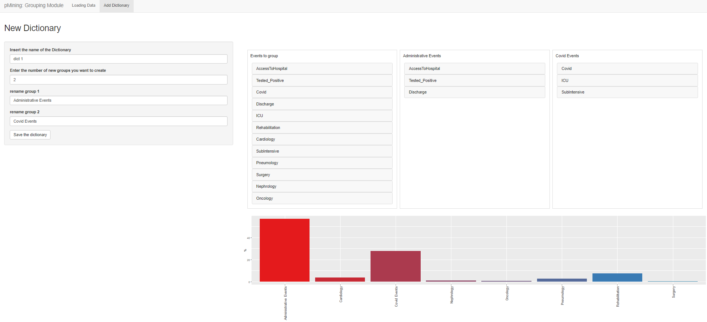
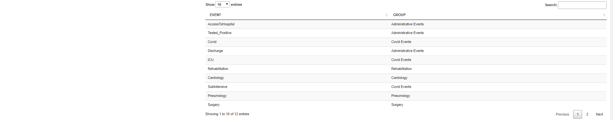
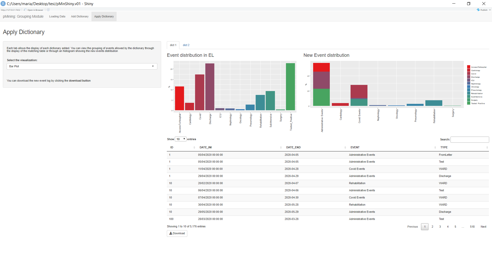

# Grouping Module: “pMining: Grouping Module” 
  This module allows the user to create and save new event dictionaries. By creating these dictionary the user could be able to split the event in the uploaded Event Log, into new groups of events. 
  Also this module is composed by several section: 
  
  {width=100%}
  

  - **Add Dictionary** section: this section allows the user to create new dictionaries by grouping the events of the Event Log. 
For each dictionary, it will be possible to define an arbitrary number of groups to which the user can assign a specific label. 
A bar plot is displayed, showing the change in the distribution of events in the Event Log as a result of their new reorganization into the user-defined groups. At the end of this section it will be possible to display a summary table showing the correspondences between events and their group in the new defined dictionary,
Each new dictionary must be saved by clicking on the appropriate *Save button*. 

  {width=100%}
  
  {width=100%}
  
  Once all dictionaries have been created and saved, you can move on to the next section by clicking the "apply dictionary" button.
  
  - **Apply Dictionary** section: This concluding section shows the comparison of event distributions before and after their grouping and shows the event log obtained by applying to the original event log in new dictionary. By clicking the *Download Button* it is possible to download the new EL.
  
  {width=100%}

